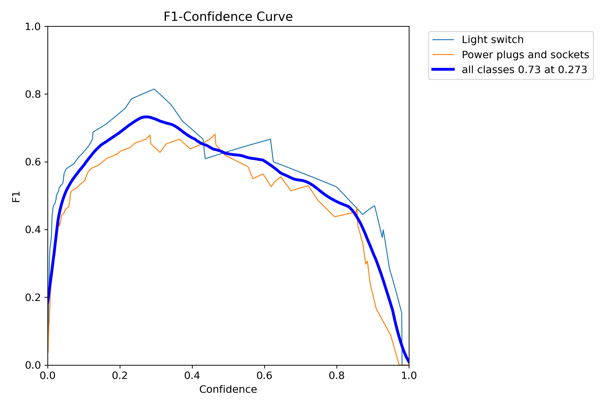
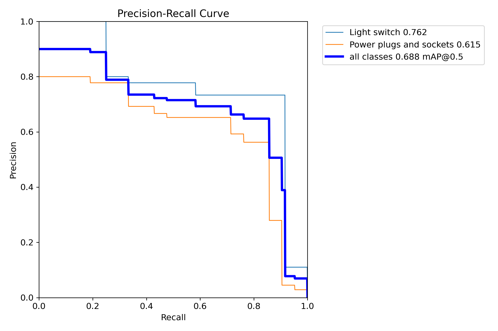
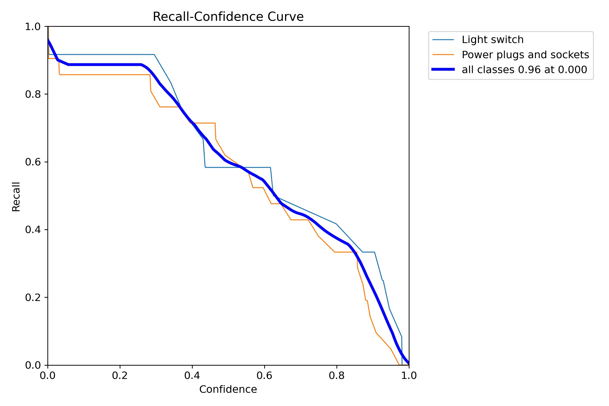
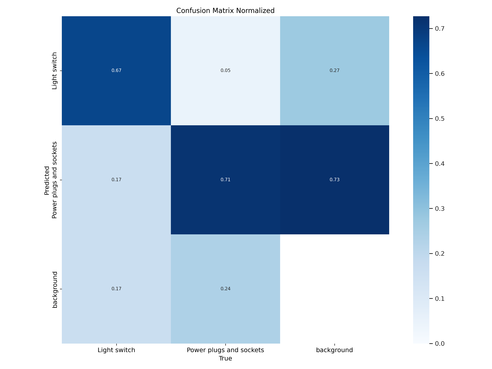
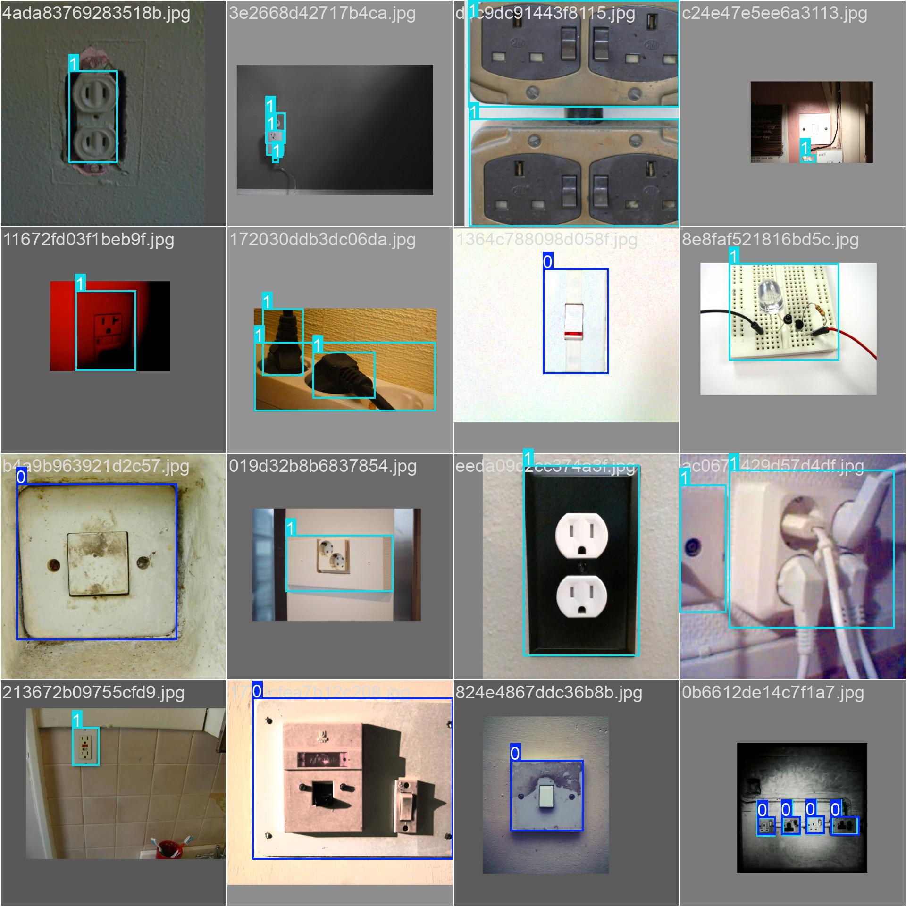

# Infrastructure Inspection using Drones and AI

## 1. Introduction
This report presents a proof of concept for infrastructure inspection using drones equipped with AI-based detection models. Our specific case focuses on detecting electrical components, such as light switches and power sockets, using a trained YOLOv11 model deployed on a Tello drone.

## 2. Project Overview

### 2.1 Objective
The goal of this project is to automate the inspection of electrical infrastructure using drone-mounted AI models. The system identifies and classifies light switches and sockets in real-time.

### 2.2 Features
- **YOLOv11-based Detection:** A trained YOLO model for detecting electrical components.
- **Drone Integration:** Live video streaming and AI processing using a Tello drone.
- **Automated Object Detection:** Real-time identification of light switches and sockets.

## 3. Data Collection and Preparation

### 3.1 Dataset
The dataset used for training and evaluation was sourced from Open Images V7.
- **Total Images:** 242
- **Training Set:** 220 images
- **Validation Set:** 22 images
- **Classes:** Light switches, power sockets


## 4. Model Selection and Training

### 4.1 Model Used
- **YOLOv11**: Chosen for its high-speed and real-time object detection capabilities.
- **Pretrained Weights:** The model was initialized with `yolo11n.pt`.

### 4.2 Training Process
The training was conducted using a custom YOLOv11 implementation.
- **Optimizer:** AdamW
- **Learning Rate:** 0.001667
- **Momentum Rate:** 0.9
- **Epochs:** 100
.png)
## 5. Model Evaluation

### 5.1 Performance Metrics
To evaluate the model, we measured:






### 5.2 Example Results


## 6. System Integration

### 6.1 Project Structure
```
├── data/
│   ├── test.jpg                  # Sample test image, you put any.
├── notebooks/
│   ├── training.ipynb            # YOLOv11 training notebook
├── src/
│   ├── drone.py                  # Drone control and AI integration
│   ├── YOLO.py                   # Deployed YOLO model class
│   ├── packages                  # Extra python code used to handle low level fucntions for drone control
├── models/
│   ├── detector.pt               # Trained YOLO model weights
├── README.md                     # Project documentation
```

### 6.2 Drone Integration
The trained YOLO model was deployed on a Tello drone, using the python library `djitellopy` on `src/drone.py`. The drone streams video, and the AI model processes frames in real-time to detect electrical components.


## 7. Conclusion
This project successfully demonstrated the feasibility of using AI-powered drones for electrical component detection. The trained YOLOv11 model effectively identified light switches and sockets in real-time. Future work will focus on improving detection accuracy and enabling fully autonomous inspection.

## 8. Future Improvements
- Enhance model performance with a larger dataset.
- Develop an automated flight control system for inspection.
- Optimize real-time processing for improved efficiency.

## How to use?
- Install python requirements using `pip install -r requirements.txt`
- Turn on your Tello drone, make sure battery is charged, if it's low, Tello will just refuse to takeoff.
- Make sure propelers are insatlled correctly, if you see drone turn it fans for takeoff, than abandons, it's a propellers not isntalled correctly type of issue.
- Connect to Tello Wifi
- Execute `python drone.py` on `src`
- Click on small window of pygame to control drone movements using 
    - Arrows for general movement on X-axis
    - W : mount up
    - S : mount down
    - A : rotate left
    - D : rotate right
    - Space : Land/takeoff
    - Q : Land

